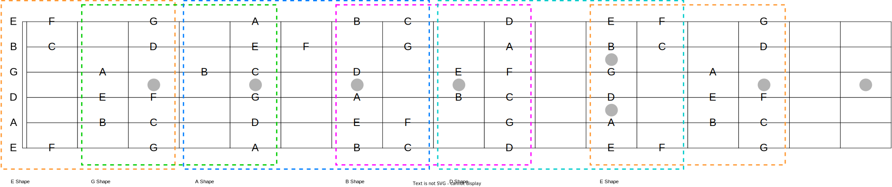

## Circle of Fifths
<div align=center></div>

## Fretboard


## Major Scales in 12 Keys
```
               W   W   H   W   W   W   H     
Major Scale: 1   2   3   4   5   6   7   1       ↓ fifths
         Ab: Ab  Bb  C   Db  Eb  F   G   Ab
         Eb: Eb  F   G   Ab  Bb  C   D   Eb
         Bb: Bb  C   D   Eb  F   G   A   Bb
          F: F   G   A   Bb  C   D   E   F
       *  C: C   D   E   F   G   A   B   C
          G: G   A   B   C   D   E   F#  G
          D: D   E   F#  G   A   B   C#  D
          A: A   B   C#  D   E   F#  G#  A
          E: E   F#  G#  A   B   C#  D#  E
          
       (  B: B   C#  D#  E   F#  G#  A#  B
         Cb: Cb  Db  Eb  Fb  Gb  Ab  Bb  Cb )
       ( Gb: Gb  Ab  Bb  Cb  Db  Eb  F   Gb
         F#: F#  G#  A#  B   C#  D#  E#  F# )
       ( Db: Db  Eb  F   Gb  Ab  Bb  C   Db
         C#: C#  D#  E#  F#  G#  A#  B#  C# )
```

## Major Scale Modes
```
                                                   Chord  Avoid
     Lydian (IV): 1   2   3  #4   5   6   7   1     ^7     
      Ionian (I): 1   2   3   4   5   6   7   1     ^7      4
  Mixolydian (V): 1   2   3   4   5   6  b7   1      7      4

     Dorian (II): 1   2  b3   4   5   6  b7   1     -7      6
    Aeolian (VI): 1   2  b3   4   5  b6  b7   1     -7      b6
  Phrygian (III): 1  b2  b3   4   5  b6  b7   1     -7      b2, b6
   Locrian (VII): 1  b2  b3   4  b5  b6  b7   1     -7b5    b2
```

## Melodic Minor Scale Modes
```
                                                    Chord
Melodic Minor (I): 1   2  b3   4   5   6   7   1    -^7
             ... :
    Altered (VII): 1  b2  #2   3  b5  b6  b7   1      7
```

## Harmonic Minor Scale Modes
```
                                                         Chord
   Harmonic Minor (I): 1   2  b3   4   5  b6   7   1     -^7
                 ... :
Mixolydian b9 b13 (V): 1  b2   3   4   5  b6  b7   1     7(b9 b13)
```