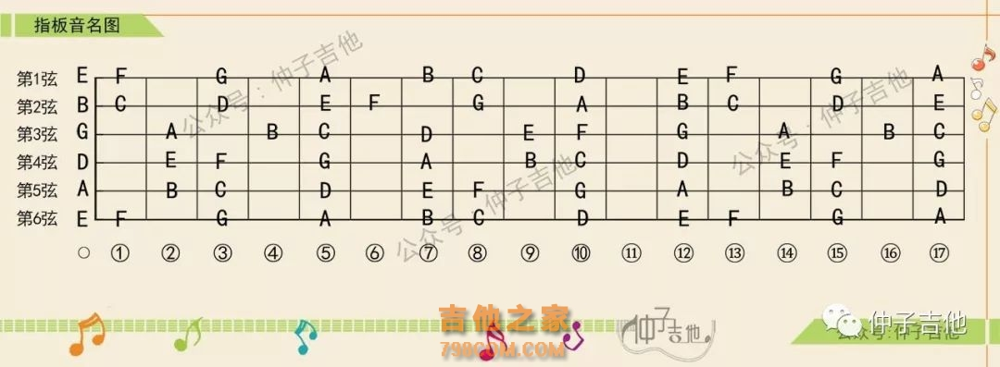
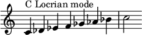

### Fretboard


### Major Scale / Ionian
```
               W   W   H   W   W   W   H
major scale: 1   2   3   4   5   6   7   1
         Db:
         Ab: Ab  Bb  C   Db  Eb  F   G   Ab
         Eb: Eb  F   G   Ab  Bb  C   D   Eb
         Bb: Bb  C   D   Eb  F   G   A   Bb
          F: F   G   A   Bb  C   D   E   F
          C: C   D   E   F   G   A   B   C
          G: G   A   B   C   D   E   F#  G
          D: D   E   F#  G   A   B   C#  D
          A: 
          E: 
          B: B   C#  D#  E   F#  G#  A#  B
```

### Locrian

```
           H   W   W   H   W   W   W
locrian: 1   2b  3b  4   5b  6b  7b  1
      G: G   Ab  Bb  C   Db  Eb  F   G
```