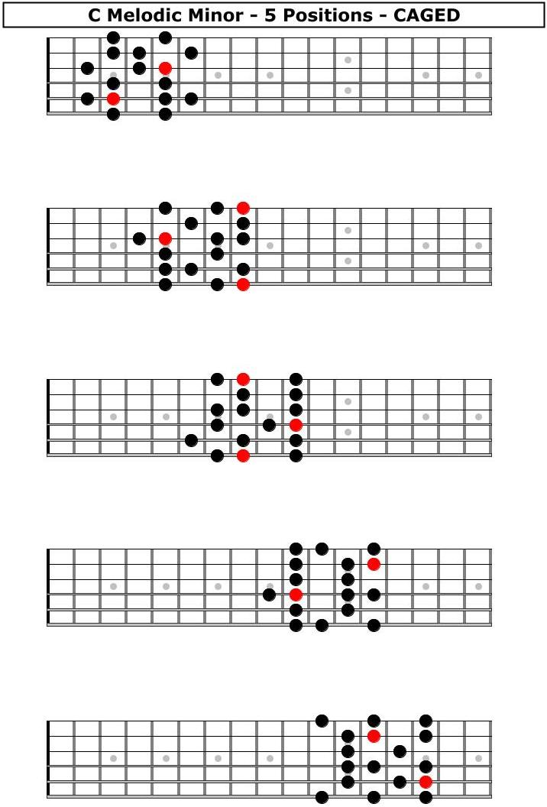

## Circle of Fifths
<p align="center"></p>

## Fretboard
|
---|---

|
---|---

## Major Scales in 12 Keys
```
               W   W   H   W   W   W   H     
Major Scale: 1   2   3   4   5   6   7   1       ↓ fifths
         Ab: Ab  Bb  C   Db  Eb  F   G   Ab
         Eb: Eb  F   G   Ab  Bb  C   D   Eb
         Bb: Bb  C   D   Eb  F   G   A   Bb
          F: F   G   A   Bb  C   D   E   F
       *  C: C   D   E   F   G   A   B   C
          G: G   A   B   C   D   E   F#  G
          D: D   E   F#  G   A   B   C#  D
          A: A   B   C#  D   E   F#  G#  A
          E: E   F#  G#  A   B   C#  D#  E
          
       (  B: B   C#  D#  E   F#  G#  A#  B
         Cb: Cb  Db  Eb  Fb  Gb  Ab  Bb  Cb )
       ( Gb: Gb  Ab  Bb  Cb  Db  Eb  F   Gb
         F#: F#  G#  A#  B   C#  D#  E#  F# )
       ( Db: Db  Eb  F   Gb  Ab  Bb  C   Db
         C#: C#  D#  E#  F#  G#  A#  B#  C# )
```

## Major Scale Modes
```
                                                Chord  Avoid
    Lydian(4): 1   2   3  #4   5   6   7   1     M7     
    Ionian(1): 1   2   3   4   5   6   7   1     M7      4
Mixolydian(5): 1   2   3   4   5   6  b7   1      7      4

    Dorian(2): 1   2  b3   4   5   6  b7   1     m7      6
   Aeolian(6): 1   2  b3   4   5  b6  b7   1     m7      b6
  Phrygian(3): 1  b2  b3   4   5  b6  b7   1     m7      b2, b6
   Locrian(7): 1  b2  b3   4  b5  b6  b7   1     m7b5    b2
```

## Melodic Minor Scale Modes
```
                                                     Chord              Avoid
     Jazz Minor(1): 1   2  b3   4   5   6   7   1    mM7                None
              ... : ...                                                 None
Lydian Dominant(4): 1   2   3  #4   5   6  b7   1    7(#11) / 7(b5)     None
              ... : ...                                                 None
        Altered(7): 1  b2  #2   3  #4  b6  b7   1    7Alt               None
```

## Harmonic Minor Scale Modes
```
                                                        Chord
   Harmonic Minor(1): 1   2  b3   4   5  b6   7   1     mM7
                ... :
Mixolydian b9 b13(5): 1  b2   3   4   5  b6  b7   1     7(b9 b13)
```

## Pentatonic Scale Modes
```
Major(1): 1   2   3   5   6   1
Minor(6): 1  b3   4   5  b7   1  (m7 chord add 4)
```

## Blues Scale Modes
```
  Major(1): 1   2  b3   3   5   6   1  (major pentatonic scale add b3)
* Minor(6): 1  b3   4  #4   5  b7   1  (minor pentatonic scale add #4 / m7 chord add 4, #4)
```
